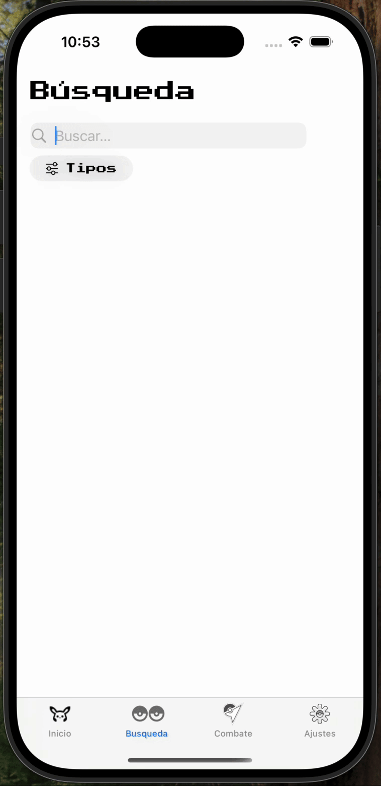
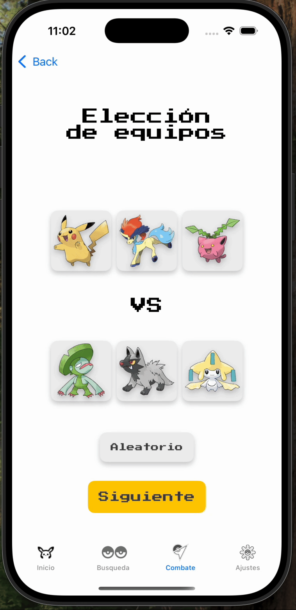

# 📖 Pokedex

Welcome to Pokedex! An immersive application crafted with Swift that allows you to explore detailed Pokémon information and engage in thrilling battles.

## ✨ Features

- 🔍 **Explore Pokémon**: Browse through detailed information on all your favorite Pokémon.
- ⚔️ **Engage in Battles**: Test your skills by engaging in thrilling Pokémon battles.
- 📈 **Track Progress**: Keep track of your progress and improve your battle strategies.

## 🎮 Main Functions

1. **Pokédex**: Keep track of the Pokémon all the creatures that have been released.


2. **Pokémon data**: Get all the information about a Pokémon, from details about their attacks to their evolutionary line.


3. **Pokémon Search**: Quickly search and filter Pokémon by name, type, or abilities.


4. **Look for shinies and mark favourites**: Identify shiny Pokémon and mark your favorite ones to easily access them later.


5. **Battle Simulator**: Simulate battles between Pokémon with dynamic animations and monitor your battle history to improve your strategies.


6. **Battle Simulator**: Simulate battles between Pokémon with dynamic animations and monitor your battle history to improve your strategies.


## 📱 Installation

1. **Clone the Repository**:
   ```bash
   git clone https://github.com/alexcraviotto/pokedex.git
   cd pokedex
   ```

2. **Open in Xcode**:
   - Open the `Pokedex.xcodeproj` file in Xcode.

3. **Run the App**:
   - Select your target device and press the `Run` button.

## 🛠️ Technologies Used

- **Swift**: The entire application is built using Swift.

## 📂 Project Structure

- `Pokedex`: Contains the main application code.
- `Resources`: Includes assets and resources such as images and data files.

---
